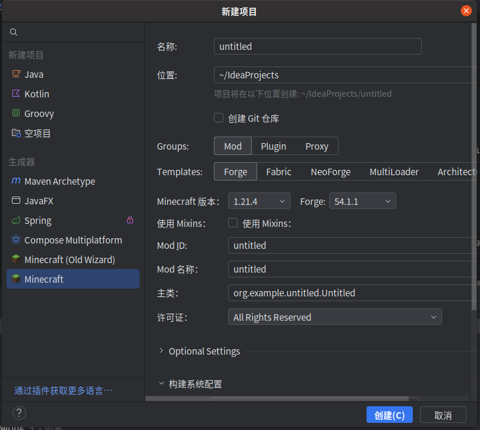
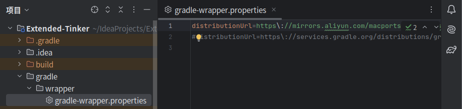

本文是基于现有教程的一些扩展说明，或许可以称作导读。

阅读之前建议有一定的代码基础，百科上也有关于 java 的一些教程。

C++/python 选手应该也是能上手的。

推荐阅读：

- [dddddsj 的文章](https://www.mcmod.cn/post/3282.html)
- [耿悠博的文章](https://www.mcmod.cn/post/3993.html)
- [一篇旧版本的教程，但很多时候仍然适用](https://neutrino.v2mcdev.com/)
- [一篇旧版本的教程，但很多时候仍然适用](https://teamcovertdragon.github.io/Harbinger/63/)

建议前两篇教程先读一遍，后两篇可以读一点，后面会标注对应部分建议阅读的内容。

# 构建工作区

可以自己下 forge mdk 折腾，不过我们比较懒，所以此处建议是直接安装 IDEA 插件：Minecraft Development。

然后直接在 IDEA 中新建项目，选择 生成器 选项卡中的 Minecraft ：



填写名称，会自动帮你生成其他信息，但也可以自行配置，每个字段的作用可见两位老师的博客。

这里建议把 Mixin 勾选上，之后自己单独添加容易出问题。

然后就可以创建工作区了，此时会自行进行构建，不过建议先停止构建，给 gradle 换个源。

> 换源，就是更换 gradle 相关文件的下载源，因官方文件托管在国外，因此换为国内镜像可以提升构建速度。

找到目录下 `gradle/wrapper/gradle-wrapper.properties`，做以下修改：

```
distributionUrl=https\://services.gradle.org/distributions/gradle-8.8-bin.zip
```

换为

```
distributionUrl=https\://mirrors.aliyun.com/macports/distfiles/gradle/gradle-8.8-bin.zip
```

请注意，此处原为 `gradle-8.8-bin.zip`，若版本号不同，请将 `8.8` 换为对应的版本号。



现在构建工作区，速度和成功率将会有显著提升。

# 有关 Minecraft & Forge 的一些介绍

事实上笔者也不是很了解，但你需要形成一个大致的认知。

mc 的代码由 java 编写，因而几乎不可能彻底闭源，因为总是能根据反编译得到一份像模像样的东西。

而针对反编译出来的源码，我们需要反混淆使得其更可度，这就是 MCP Mapping，一套猜测反编译出的符号是什么用处的映射表。

而在此基础上有了 Forge 这样的项目，其中 Forge Mod Loader（FML）用于加在 Mod，而 MinecraftForge 则是一个修改了 mc 源代码的项目，它使得 mc 的代码更加合理也更具扩展性。

在 MinecraftForge 的工作中，一个重要的部分是事件系统，原版 mc 中没有事件，因此很多东西写死后，除非修改原类（事实上可以用 Mixin 做到），否则无法完成。

## 事件系统

事件系统的工作模式大概是：

- 一开始，定义一些事件类型，不需要做其它的事。
- 定义一些方法，处理对应的一类事件，将它们注册到监听器的列表里，并指定优先级。
- 某件事情将要发生时，按照优先级调用监听器，然后根据调用后的结果决定是否发生，以及各个相关量的变化。


## 服务端 与 客户端

一个值得注意的部分是 服务端 与 客户端。

自从 mc 加入联机系统以来，所有的游戏都被拆分为 服务端 与 客户端 两部分，就连单人游戏也是如此。

实体的移动、方块破坏 等都是 服务端 控制的，也就是整个游戏世界发生的。

而玩家所看见的，以及一些不影响世界的行为，比如 按键、渲染 这些都是客户端的工作。

之所以介绍这个，是因为我们有时需要在 服务端 和 客户端 间通信，来处理特殊的需求。

比如添加 按下 v 键冲刺，左键空气爆炸 这样的功能，就会涉及到服务端和客户端间的通信。

其中 左键空气爆炸 这个需求甚至需要我们手动完成通信这一步骤，因为原版并没有在左键空气时从客户端向服务端发包（发送信息）。

## Mixin

Mixin 用于往已有的代码中加东西，也就是我们上面提到的修改原类的代码。

如果详细介绍篇幅就过长了，此处推荐阅读 [Fabric 官方给出的 Mixin 教程](https://wiki.fabricmc.net/zh_cn:tutorial:mixin_examples)，这和 forge 是基本通用的。

如果你打不开 fabric wiki，可以读 [这篇知乎专栏](https://zhuanlan.zhihu.com/p/677090570)。

事实上 Mixin 官方也是有教程的，但是 [英文](https://mixin-wiki.readthedocs.io/)。

这里描述一个上述文章内没有提及（wiki 除外）但我遇到的问题的解决方案：

```java
// 在外面定义一个接口
public interface IA {
	void setValue(int value);
	int gettValue();
}

// Mixin 类可以原类没实现的接口。
@Mixin(A.class)
public class Amixin implements IA {
	@Unique
	private int value;
	public void setValue(int value) { this.value = value; }
	public int gettValue() { return value; }
}

// 在其他地方使用 Mixin 类中添加的 value
public class B {
	public void work(A a) {
		return a.value; // 编译错误
		return ((Amixin)a).value; // 编译错误
		return a.getValue(); // 编译错误
		return ((Amixin)a).getValue(); // 编译错误
		return ((IA)a).getValue(); // 正确用法
	}
}
```

# 添加工具

阅读下面的部分前，建议阅读 [Item 和 ItemStack](https://neutrino.v2mcdev.com/item/itemstack.html)。

开发过程中建议去 github 下一份匠魂源码，这样方便学习。

## 匠魂本身的工具

所有种类的匠魂 工具（盔甲、手杖） 都是 ModifiableItem 或其某个子类的实例。

那么我们就需要介绍 ModifiableItem 是什么，跳转定义会发现这是 TieredItem 的一个子类，同时实现了 IModifiableDisplay 接口。

显然 TieredItem 是原版中 Item 的一个子类，大概是某类有附加信息的物品，而 IModifiableDisplay 接口就意味着这是一件能以匠魂方式修改的工具，或者说实现了 IModifiableDisplay 就可以视作一件匠魂物品。

## 添加一类新工具

首先建议你考虑这件工具本身是否和现有的匠魂工具有本质区别。

比如你打算添加一个近战武器 长剑，那么这就和匠魂本身的 剑 是类似的，但拥有更长的攻击距离。

或者是一个新的挖掘工具，能破坏所有种类的方块，但这也是原版就有的内容。

如果是这种情况，那么你就可以直接使用 ModifiableItem，或者它的子类，比如 ModifiableSwordItem、ModifiableBowItem，然后在 data 中填写不同的数值来使得其具有不同的手感。

下面两节会以工具和盔甲作为示例，描述如何添加一个新的 IModifiableDisplay 实现或者 ModifiableItem 的子类。

### 工具示例：烟花火箭

我知道这有点迷惑，但匠魂烟花火箭是个和匠魂打火石一样帅气的东西。

我们新建一个包 tool，然后在 tool 目录下新建 FireworkRocket 类。

事实上烟花火箭和普通匠魂物品的主要区别在于右键时有特殊的行为，因此可以直接继承 ModifiableItem，然后在其基础上修改。

```java
public class FireworkRocket extends ModifiableItem {
    public FireworkRocket(Properties properties, ToolDefinition toolDefinition) {
        super(properties, toolDefinition);
    }
    // useOn 会在右键使用物品时被调用进行处理，context 存储了关于这次使用的信息（哪只手，哪个玩家等）
    @Override
    public @NotNull InteractionResult useOn(UseOnContext context) {
        // 这里实现右键地面时放一个烟花火箭
    }
    // use 会在右键使用物品时被调用进行处理，参数是使用时的信息。
    @Override
    public @NotNull InteractionResultHolder<ItemStack> use(@NotNull Level level, Player player, @NotNull InteractionHand hand) {
        // 这里实现鞘翅滑翔时右键加速飞行
    }
}
```

那么这两个函数如何实现呢？在没有了解过的情况下，最好的方法就是阅读别人的实现！

键入 `FireworkRocketItem`，从 IDEA 的提示中找到原版的 FireworkRocketItem 类，然后进去阅读一下，把里面的东西粘贴出来！

你会发现有大量用不上的内容，但不急着删除，以后可能会有用。

删掉 FireworkRocketItem 的构造函数，我们已经实现了构造函数。

然后回想一下，原版中烟花火箭使用后是数量减一，但我们这个是消耗耐久度，因此需要修改。

```java
    @Override
    public @NotNull InteractionResult useOn(UseOnContext context) {
        Level level = context.getLevel();
        if (!level.isClientSide) {
            ItemStack stack = context.getItemInHand();
            ToolStack tool = ToolStack.from(stack);
            if (!tool.isBroken()) {
                Vec3 clickLocation = context.getClickLocation();
                Direction clickedFace = context.getClickedFace();
                FireworkRocketEntity fireworkRocketEntity = new FireworkRocketEntity(level, context.getPlayer(), clickLocation.x + (double) clickedFace.getStepX() * 0.15, clickLocation.y + (double) clickedFace.getStepY() * 0.15, clickLocation.z + (double) clickedFace.getStepZ() * 0.15, stack);
                level.addFreshEntity(fireworkRocketEntity);
                // 下面这一行原来是 stack.shrink(1);
                stack.hurtAndBreak(1, Objects.requireNonNull(context.getPlayer()), (player) -> player.broadcastBreakEvent(context.getHand()));
            }
        }
        return InteractionResult.sidedSuccess(level.isClientSide);
    }

    @Override
    public @NotNull InteractionResultHolder<ItemStack> use(@NotNull Level level, Player player, @NotNull InteractionHand hand) {
        if (player.isFallFlying()) {
            ItemStack stack = player.getItemInHand(hand);
            ToolStack tool = ToolStack.from(stack);
            if (!level.isClientSide && !tool.isBroken()) {
                FireworkRocketEntity fireworkRocketEntity = new FireworkRocketEntity(level, stack, player);
                level.addFreshEntity(fireworkRocketEntity);
                if (!player.getAbilities().instabuild)
                    // 下面这一行原来是 stack.shrink(1);
                    stack.hurtAndBreak(1, Objects.requireNonNull(player), (player1) -> player1.broadcastBreakEvent(hand));
                player.awardStat(Stats.ITEM_USED.get(this));
            }
            return InteractionResultHolder.sidedSuccess(player.getItemInHand(hand), level.isClientSide());
        } else {
            return InteractionResultHolder.pass(player.getItemInHand(hand));
        }
    }
```

注意我代码中更改了变量名，因为反编译出来的确实丑。

现在 Item 类就编写完成了，下个步骤是注册。

### 工具示例：马铠

首先阅读原版中的 Horse 类，发现它拥有一个 isArmor(ItemStack) 的方法，当这个方法返回 true 时，ItemStack 被允许装到马身上。

而原版中这个东西的实现如下：

```java
    public boolean isArmor(ItemStack p_30731_) {
        return p_30731_.getItem() instanceof HorseArmorItem;
    }
```

而匠魂中，盔甲工具都是从 ModifiableArmorItem 中定义而来的。

那么为了添加一个新的马铠，我们有两种选择：

- 令其继承自 HorseArmorItem，然后考虑实现 IModifiableDisplay 的接口。
- 令其继承自 ModifiableArmorItem，然后 Mixin 大改原版代码。

这里我们选择了第一种方案，一方面大量 Mixin 不利于兼容性，另一方面，原版中很多时候判断一个物品是不是马铠都没调用 isArmor 这个方法，而是直接判断其 Item 的类型，这使得 Mixin 的维护难度大大增高。

直接在 tool 目录下新建一个 HorseArmor 类继承自 HorseArmorItem，然后调转到 ModifiableArmorItem，无脑把全部内容搬过来。

然后你会发现大量报错，一大原因是 HorseArmorItem 直接继承自 Item，而 ModifiableArmorItem 继承子 ArmorItem，粘贴过来后失去了 ArmorItem 中添加的内容。

怎么办呢？将 ArmorItem 里面的内容也搬过来，然后合并相同的函数即可。

这个部分只需要体力劳动，不过你可能看不懂最后调用 super() 构造函数时的参数，所以这里介绍一下：第一个耐久是防御力，第二个字符串或者 ResourceLocation 是材质位置（穿在马上时的实体材质），第三个是物品属性。

这里防御力和材质位置后面都会被我们重新处理，所以随便填即可，物品属性是构造函数里传给了你的。

```java
    // 这个函数可以完全不管，因为我们后面要 Mixin 改变马铠的渲染，用不着它
    @Override
    public ResourceLocation getTexture() {
        return this.texture;
    }
    @Override
    public int getProtection() {
        // this.getDefense() 是从 ArmorItem 里粘出来的，其返回值是在构造函数里就根据盔甲材料计算好的
        return this.getDefense();
    }
```

#### 让马铠成为一个像模像样的盔甲

现在的马铠装在马身上，马受到攻击后确实会有防御力加成，但形如 盔甲韧性、击退抗性 都是不生效的，马铠也不会因攻击降低耐久度，同时整个马会变成紫黑块。

查找后会发现防御力是由 Horse 在 setArmorEquipment 中调用 getProtection() 添加的，因此我们可以直接 Mixin 进去添加别的属性：

```java
    @Inject(method = "setArmorEquipment", at = @At(value = "INVOKE", target = "Lnet/minecraft/world/entity/animal/horse/Horse;isArmor(Lnet/minecraft/world/item/ItemStack;)Z", shift = At.Shift.BY, by = 1))
    public void setArmorEquipmentMixin(@NotNull ItemStack itemStack, CallbackInfo ci) {
        if (itemStack.getItem() instanceof HorseArmor) {
            float armor_toughness = ((HorseArmor)itemStack.getItem()).getToughness();
            if (armor_toughness != 0) Objects.requireNonNull(getAttribute(Attributes.ARMOR_TOUGHNESS)).addTransientModifier(new AttributeModifier(ARMOR_MODIFIER_UUID, "Horse armor bonus", armor_toughness, AttributeModifier.Operation.ADDITION));
            float knockback_resistance = ((HorseArmor)itemStack.getItem()).getKnockbackResistance();
            if (knockback_resistance != 0) Objects.requireNonNull(getAttribute(Attributes.KNOCKBACK_RESISTANCE)).addTransientModifier(new AttributeModifier(ARMOR_MODIFIER_UUID, "Horse armor bonus", armor_toughness, AttributeModifier.Operation.ADDITION));
        }
    }
```

如果你不会 Mixin，请参阅之前提到的教程。不要忘了把你的 Mixin 类添加到 mixins.json 中！

此处的 getToughness() 和 getKnockbackResistance() 是我们另外实现的，盔甲韧性 和 击退抗性 在构造函数中都已被计算出来了。

此时 盔甲韧性、击退抗性 的问题解决了，现在我们来考虑原版没考虑到的减耐久。

于是在 Mixin 类中重写 hurtArmor 函数：

```java
    @Override
    protected void hurtArmor(@NotNull DamageSource damageSource, float damage) {
        if (!(damage <= 0.0F)) {
            damage /= 4.0F;
            if (damage < 1.0F) {
                damage = 1.0F;
            }

            ItemStack itemstack = this.getArmor();
            if ((!damageSource.isFire() || !itemstack.getItem().isFireResistant()) && itemstack.getItem() instanceof HorseArmor) {
                itemstack.hurtAndBreak((int)damage, (AbstractHorse)this, (abstractHorse) -> abstractHorse.broadcastBreakEvent(EquipmentSlot.CHEST));
            }
        }
    }
```

这部分代码是从 Player 类中抄出来的。

现在来解决紫黑块，这就涉及到渲染机制的问题，我们再开一个小节。

#### 实体渲染的大致逻辑

对于一个实体 A，控制其如何渲染的是 ARenderer 这个类，如 HorseRenderer、PlayerRenderer。

渲染过程中，会根据对应的 Model（实体模型） 进行处理，如 HorseModel<Horse>（此处之所以是泛型，其实是因为所有 AbstractHorse，包括 马，驴，骡，羊驼等 都用了几乎的 Model，因此不同的 AbstractHorse 所用的 Model 都是这个的一个实例）。

而处理过程就是往上加纹理，包括马本身都是一个纹理层，而纹理处理就是 RenderLayer 类的一个子类来实现。

现在看到 HorseRendered 这个类：

```java
@OnlyIn(Dist.CLIENT)
public final class HorseRenderer extends AbstractHorseRenderer<Horse, HorseModel<Horse>> {
    private static final Map<Variant, ResourceLocation> LOCATION_BY_VARIANT = (Map)Util.make(Maps.newEnumMap(Variant.class), (p_114874_) -> {
        p_114874_.put(Variant.WHITE, new ResourceLocation("textures/entity/horse/horse_white.png"));
        p_114874_.put(Variant.CREAMY, new ResourceLocation("textures/entity/horse/horse_creamy.png"));
        p_114874_.put(Variant.CHESTNUT, new ResourceLocation("textures/entity/horse/horse_chestnut.png"));
        p_114874_.put(Variant.BROWN, new ResourceLocation("textures/entity/horse/horse_brown.png"));
        p_114874_.put(Variant.BLACK, new ResourceLocation("textures/entity/horse/horse_black.png"));
        p_114874_.put(Variant.GRAY, new ResourceLocation("textures/entity/horse/horse_gray.png"));
        p_114874_.put(Variant.DARKBROWN, new ResourceLocation("textures/entity/horse/horse_darkbrown.png"));
    });

    public HorseRenderer(EntityRendererProvider.Context p_174167_) {
        super(p_174167_, new HorseModel(p_174167_.bakeLayer(ModelLayers.HORSE)), 1.1F);
        this.addLayer(new HorseMarkingLayer(this));
        this.addLayer(new HorseArmorLayer(this, p_174167_.getModelSet()));
    }

    public ResourceLocation getTextureLocation(Horse p_114872_) {
        return (ResourceLocation)LOCATION_BY_VARIANT.get(p_114872_.getVariant());
    }
}
```

值的我们注意的是构造函数里的第三行，它调用父类中的 addLayer，添加了一个 HorseArmorLayer。

HorseArmorLayer 是 RenderLayer 的一个子类，代表了一层马铠盔甲纹理，我们要做的就是修改这个类，使得它在渲染匠魂马铠的纹理时能按部件渲染。

这里直接给代码：

```java
// 辅助类，存储了灰度图的资源位置，以及如何对这张灰度图染色
public class TextureInformation {
    public ResourceLocation resourceLocation;
    public int color;

    public TextureInformation(ResourceLocation resourceLocation, int color) {
        this.resourceLocation = resourceLocation;
        this.color = color;
    }
}
```

```java
@Mixin(HorseArmorLayer.class)
public abstract class HorseArmorLayerMixin extends RenderLayer<Horse, HorseModel<Horse>>  {
    @Shadow @Final private HorseModel<Horse> model;

    // 这个数组存储了每个部件对应的纹理灰度图的资源位置
    @Unique
    private static final ResourceLocation[] extended_tinker$textureLocations = new ResourceLocation[]{Extended_tinker.getResource("textures/tinker_armor/horse_armor/maille1_armor.png"), Extended_tinker.getResource("textures/tinker_armor/horse_armor/shield1_armor.png"), Extended_tinker.getResource("textures/tinker_armor/horse_armor/maille2_armor.png"), Extended_tinker.getResource("textures/tinker_armor/horse_armor/shield2_armor.png"), Extended_tinker.getResource("textures/tinker_armor/horse_armor/head_armor.png")};

    public HorseArmorLayerMixin(RenderLayerParent<Horse, HorseModel<Horse>> p_117346_) {
        super(p_117346_);
    }

    // 辅助函数：从马身上获取的马铠 ItemStack 换为 ToolStack，这相交于 ItemStack 更容易处理匠魂相关的信息
    @Unique
    private ToolStack extended_tinker$getTool(Horse horse) {
        return ToolStack.from(horse.getArmor());
    }

    // 根据部件的编号获得对应的渲染信息
    @Unique
    public TextureInformation extended_tinker$getTextureLocation(Horse horse, int partIndex) {
        if (partIndex >= 0 && partIndex < extended_tinker$textureLocations.length) {
            MaterialVariant material = extended_tinker$getTool(horse).getMaterial(partIndex);
            Optional<MaterialRenderInfo> optional = MaterialRenderInfoLoader.INSTANCE.getRenderInfo(material.getVariant());
            if (optional.isPresent()) {
                MaterialRenderInfo info = optional.get();
                return new TextureInformation(extended_tinker$textureLocations[partIndex], info.getVertexColor());
            }
        }
        return new TextureInformation(this.getTextureLocation(horse), -1);
    }


    // 这个函数用于处理染色后添加到 model 中，color 实质是对 RGBA 颜色信息的压缩，解码出 RGBA 四个属性后传给 renderToBuffer，注意此处参数接受的是四个 float，因此四个属性要除以 255
    @Unique
    private void extended_tinker$performRendering(VertexConsumer vertexConsumer, PoseStack poseStack, int packedLightIn, int color) {
        this.model.renderToBuffer(poseStack, vertexConsumer, packedLightIn, OverlayTexture.NO_OVERLAY, (float) ((color >>> 16 & 255) / 255.0), (float) ((color >>> 8 & 255) / 255.0), (float) ((color & 255) / 255.0), (float) ((color >>> 24 & 255) / 255.0));
    }
    
    // 根据部件的编号进行渲染
    @Unique
    private void extended_tinker$renderPart(PoseStack poseStack, MultiBufferSource multiBufferSource, int packedLightIn, Horse horse, int partIndex) {
        TextureInformation information = this.extended_tinker$getTextureLocation(horse, partIndex);
        VertexConsumer vertexConsumer = multiBufferSource.getBuffer(RenderType.entityCutoutNoCull(information.resourceLocation));
        extended_tinker$performRendering(vertexConsumer, poseStack, packedLightIn, information.color);
    }

    // 会被外部调用的函数，原版是直接查询 HorseArmorItem 中的 getTexture()，此处我们判读出是 HorseArmor 后，直接按部件渲染出来后终止这个函数
    @Inject(method = "render(Lcom/mojang/blaze3d/vertex/PoseStack;Lnet/minecraft/client/renderer/MultiBufferSource;ILnet/minecraft/world/entity/animal/horse/Horse;FFFFFF)V", at = @At("HEAD"), cancellable = true)
    public void render(PoseStack poseStack, MultiBufferSource multiBufferSource, int packedLightIn, Horse horse, float p_117036_, float p_117037_, float p_117038_, float p_117039_, float p_117040_, float p_117041_, CallbackInfo ci) {
        ItemStack armor = horse.getArmor();
        if (armor.getItem() instanceof HorseArmor) {
            this.getParentModel().copyPropertiesTo(this.model);
            this.model.prepareMobModel(horse, p_117036_, p_117037_, p_117038_);
            this.model.setupAnim(horse, p_117036_, p_117037_, p_117039_, p_117040_, p_117041_);
            ToolStack toolStack = extended_tinker$getTool(horse);
            for (int partIndex = 0; partIndex < toolStack.getMaterials().size(); ++partIndex)
                extended_tinker$renderPart(poseStack, multiBufferSource, packedLightIn, horse, partIndex);
            ci.cancel();
        }
    }
}
```

可能初次接触时会疑惑为何我们需要自己进行染色，毕竟匠魂三官方已经提供了纹理生成器可以导出。

然而实际上那东西的原理也是染色，并且我没找到调用接口，所以只好自己实现了。

### 注册工具